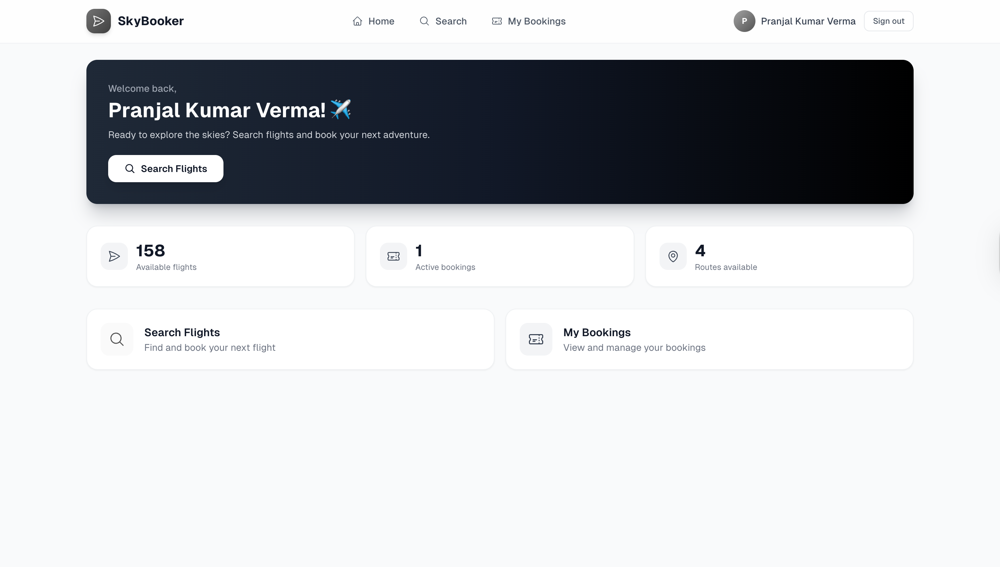
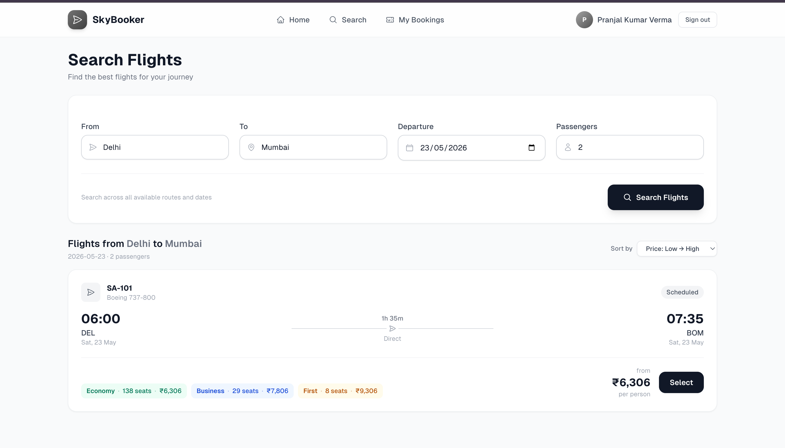
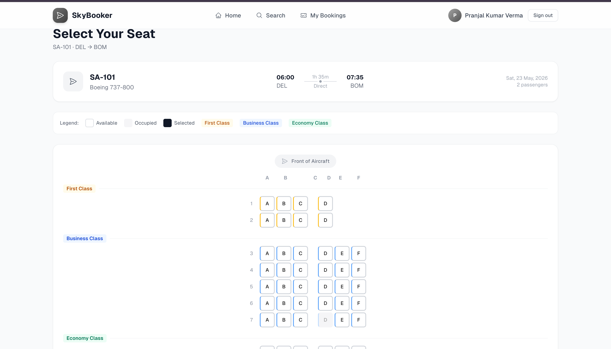
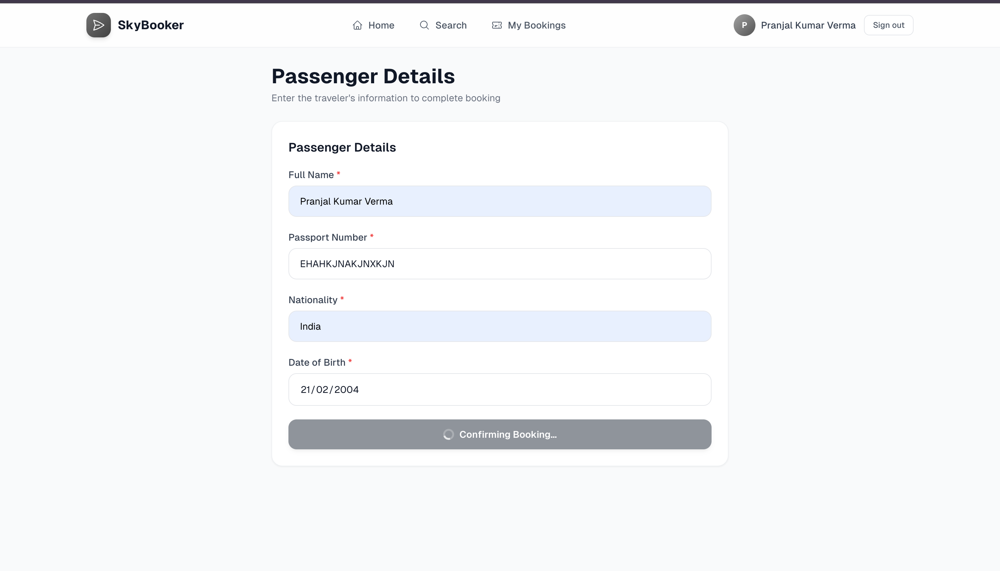

<div align="center">
  
  <h1>✈️ SkyBooker</h1>
  <p><strong>Next-Generation Flight Management & Booking Platform</strong></p>

  <p>
    <a href="https://flight-management-app-eight.vercel.app"></a>
    
    
    
    
  </p>
</div>

<br />

SkyBooker is a **production-grade, full-stack Progressive Web Application (PWA)** engineered to demonstrate advanced web development concepts including concurrency handling, real-time WebSocket features, sophisticated UI/UX design, and secure database transactions. 

It simulates a premium airline booking platform with an end-to-end, highly polished user experience inspired by tier-1 travel products.

---

## 📑 Table of Contents

- [✨ Key Features](#-key-features)
- [📸 Showcase](#-showcase)
- [🏗️ Architecture & Tech Stack](#️-architecture--tech-stack)
- [⚙️ Local Installation](#️-local-installation)
- [🧪 Test Accounts](#-test-accounts)
- [🔑 Technical Decisions & Tradeoffs](#-technical-decisions--tradeoffs)
- [🛡️ Database & Security](#️-database--security)
- [📂 Project Structure](#-project-structure)
- [📄 License](#-license)

---

## ✨ Key Features

SkyBooker goes beyond a simple CRUD application, implementing robust logic for a seamless and secure booking flow:

### 🎨 Premium UI/UX
- **Glassmorphism Design:** Beautiful translucent overlays, smooth micro-animations, and a cohesive "Stratosphere" color palette.
- **Animated SVG Hero:** Dynamic flight paths rendered natively with SVG animations that respect `prefers-reduced-motion`.
- **Responsive Layouts:** Fluid, mobile-first design with interactive seat selection and highly optimized touch targets.

### 🚀 Core Engineering
- **Atomic Seat Locking:** Prevents double-booking via PostgreSQL `SELECT FOR UPDATE` row-level locking.
- **Real-Time Seat Maps:** Powered by Supabase WebSockets to instantly broadcast seat availability across all active client sessions.
- **Zustand Persistence:** Advanced client-side state management that survives browser refreshes while safely excluding sensitive PII.
- **Offline PWA Support:** Installable across devices with caching strategies (`StaleWhileRevalidate`) to handle spotty network conditions.
- **Robust Authentication & RLS:** Secure server-side sessions with granular Row Level Security ensuring users only access their own data.

---

## 📸 Showcase

| Landing Page | Flight Search Panel |
|:---:|:---:|
|  |  |

| Interactive Seat Map | Passenger Details |
|:---:|:---:|
|  |  |

---

## 🏗️ Architecture & Tech Stack

```text
┌──────────────────────────────────────────────────────────┐
│                    Next.js 14 (App Router)                │
│  ┌─────────────────┐  ┌──────────────────────────────┐   │
│  │ Server Components│  │ Client Components             │   │
│  │ - Flight search  │  │ - Realtime Seat Map          │   │
│  │ - Bookings list  │  │ - Forms & Interactions       │   │
│  └────────┬─────────┘  └──────────────┬───────────────┘   │
│           │  Server Actions            │ Zustand Store     │
│           └────────────┬──────────────┘                   │
└────────────────────────┼─────────────────────────────────┘
                         ▼
┌──────────────────────────────────────────────────────────┐
│                       Supabase                            │
│  ┌──────────┐  ┌─────────────┐  ┌──────────────────────┐ │
│  │   Auth   │  │ PostgreSQL  │  │ Realtime WebSocket   │ │
│  │  (SSR)   │  │ + RPCs      │  │ (Seats table)        │ │
│  └──────────┘  └─────────────┘  └──────────────────────┘ │
└──────────────────────────────────────────────────────────┘
```

- **Frontend:** [Next.js 14](https://nextjs.org/) (App Router), [React](https://react.dev/), [Tailwind CSS](https://tailwindcss.com/)
- **Backend/Database:** [Supabase](https://supabase.com/) (PostgreSQL, Auth, Real-Time)
- **State Management:** [Zustand](https://github.com/pmndrs/zustand)
- **PWA Configuration:** `next-pwa`
- **Validation:** `zod` for strict schema validation
- **Deployment:** [Vercel](https://vercel.com/)

---

## ⚙️ Local Installation

### Prerequisites
- Node.js 18.x or later
- npm 9.x or later
- A Supabase project (if you want to run your own backend)

### 1. Clone & Install
```bash
git clone https://github.com/pran-ekaiva006/flight-management-app.git
cd flight-management-app
npm install
```

### 2. Environment Variables
Copy the example environment file:
```bash
cp .env.example .env.local
```
Fill in `.env.local` with your Supabase credentials:
```env
NEXT_PUBLIC_SUPABASE_URL=https://your-project.supabase.co
NEXT_PUBLIC_SUPABASE_ANON_KEY=your_anon_key
SUPABASE_SERVICE_ROLE_KEY=your_service_role_key
```

### 3. Database Setup (Supabase)
Navigate to the **Supabase Dashboard → SQL Editor** and execute the migration files found in the `supabase/migrations/` directory sequentially, followed by the seed file:
```text
1. 00001_create_core_schema.sql
2. 00002_enhance_rls_policies.sql
3. 00003_enhanced_seat_locking_rpc.sql
4. 00004_reschedule_booking_rpc.sql
5. seed.sql  # Creates sample flights, seats, and test accounts
```
> **Note:** Go to **Authentication → Providers → Email** in Supabase and disable "Confirm email" to allow instant login for local testing.

### 4. Run Development Server
```bash
npm run dev
```
The application will be available at [http://localhost:3000](http://localhost:3000).

---

## 🧪 Test Accounts

For demonstration purposes, the database is seeded with the following accounts. You can use these to log in immediately on the live demo or your local setup:

| User Type | Email | Password | Purpose |
|---|---|---|---|
| **Primary Demo** | `demo@example.com` | `Demo@1234` | General exploration of the platform. |
| **Concurrent Test** | `reviewer@example.com` | `Review@1234` | Open in a second browser window to test the real-time WebSocket seat map and database race conditions. |

> 💡 **Pro Tip for Testing Concurrency:** Log in with both accounts in separate browser windows. Attempt to book the exact same seat on the same flight simultaneously. The first request will lock the row, and the second request will be gracefully rejected by the PostgreSQL database, showing an error toast in the UI.

---

## 🔑 Technical Decisions & Tradeoffs

- **Database-Level Seat Locking:** We use PostgreSQL `SELECT FOR UPDATE` within an RPC instead of Serializable transactions. This isolates the lock specifically to the requested seat, ensuring high concurrency throughput without forcing unnecessary transaction rollbacks for unrelated bookings.
- **Trigger-Enforced Business Logic:** The 2-hour departure cancellation restriction is enforced via a `BEFORE UPDATE` trigger on the database level. This guarantees the rule cannot be bypassed, regardless of which API endpoint or client initiates the request.
- **Why Zustand?** The booking process spans across multiple routes. Zustand's persistence middleware effortlessly maintains state across browser reloads, while its `partialize` configuration ensures sensitive fields (like Passport Numbers) are securely omitted from `localStorage`.
- **AirLabs Fallback & Mock Data:** Flight schedules are normalized from the AirLabs API. Due to limitations of the free API tier, mock prices are deterministically generated via a hashing function based on the flight duration, time-of-day, and flight IATA code.

---

## 🛡️ Database & Security

### Security Implementation
- **Row Level Security (RLS):** Policies ensure that tables like `bookings`, `passengers`, and `reschedules` can only be queried or modified where `user_id = auth.uid()`.
- **Server Actions:** All critical mutations (booking, cancelling) occur on the server side, validating session integrity before invoking Supabase RPCs.

### Core Schema Overview
- `flights` — Core schedule data, origin, destination, times.
- `seats` — Maps directly to `flight_id` with real-time tracking of `is_available`.
- `bookings` — User bookings with unique PNR codes.
- `passengers` — Links sensitive PII safely to specific `bookings`.

---

## 📂 Project Structure

```text
src/
├── app/                    # Next.js App Router (Pages & API Routes)
│   ├── (auth)/             # Authentication views
│   ├── (main)/             # Core application layout & views
│   └── offline/            # PWA fallback page
├── components/             # Reusable UI components (Layout, Shared)
├── features/               # Domain-driven feature modules
│   ├── auth/               # Forms & auth actions
│   ├── booking/            # Booking management & utilities
│   ├── flights/            # Flight search & results
│   └── seats/              # Seat map & real-time hooks
├── lib/                    # Core libraries (Supabase clients, AirLabs API)
└── store/                  # Zustand global state definitions
supabase/
├── migrations/             # Sequential SQL schema migrations
└── seed.sql                # Seed script for initial testing data
```

---

## 📄 License

This project is open-source and available under the [MIT License](LICENSE).

<div align="center">
  <br />
  <p>Built by <strong>Pranjal Kumar Verma</strong></p>
</div>
