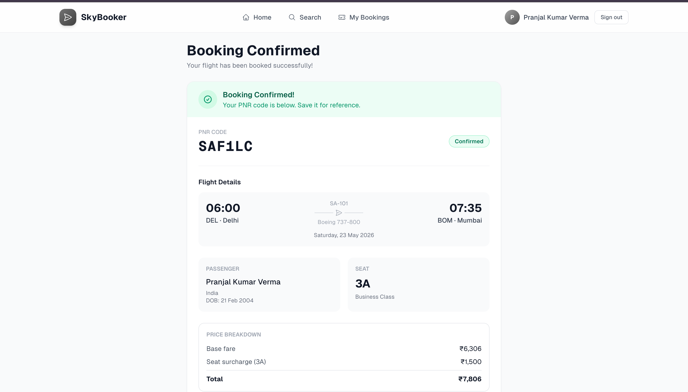

# ✈️ Source Asia — Flight Management App

**📁 Repository:** [github.com/pran-ekaiva006/flight-management-app](https://github.com/pran-ekaiva006/flight-management-app)
**🔴 Live Demo:** [flight-management-app-eight.vercel.app](https://flight-management-app-eight.vercel.app)

---

## 📌 Project Summary

Source Asia Flight Management App is a **production-grade, full-stack Progressive Web Application** built as part of the Source Asia Frontend Internship Technical Assignment. It simulates a real airline booking platform with end-to-end functionality:

- ✈️ **Flight search** — filter by origin, destination, date and passenger count across 5 routes with 30 days of seeded daily flights
- 💺 **Interactive seat map** — visual Economy / Business / First class grid, updated live via WebSocket
- 🔒 **Race-condition-safe booking** — PostgreSQL `SELECT FOR UPDATE` row-locking prevents two users booking the same seat simultaneously
- 📋 **Passenger details** — validated form with name, passport, nationality and DOB
- 🎫 **PNR generation** — unique booking reference with a printable confirmation ticket
- 🔄 **Cancel & Reschedule** — with a 2-hour departure cutoff enforced at the DB trigger level
- ⚡ **Supabase Realtime** — seat status changes broadcast to all connected tabs via WebSocket
- 🗃️ **Zustand persistence** — full booking flow survives browser refresh; sensitive fields excluded from localStorage
- 📱 **PWA** — installable on mobile/desktop, works offline with a custom fallback page
- 🛡️ **Row Level Security** — users can only read and write their own bookings and passenger records

**Tech Stack:** Next.js 14 (App Router) · Supabase (PostgreSQL + Auth + Realtime) · Zustand · Tailwind CSS · TypeScript · next-pwa


## 📸 App Screenshots

| Dashboard | Search Flights |
|:---:|:---:|
|  |  |

| Realtime Seat Map | Passenger Details |
|:---:|:---:|
|  |  |

| Booking Confirmed |
|:---:|
|  |

---

## 🧪 Test Accounts (Ready to Use)

These accounts are pre-confirmed in the live Supabase instance. No signup needed:

| # | Email | Password | Role |
|---|---|---|---|
| 1 | `demo@sourceasia.com` | `Demo@1234` | Primary demo user |
| 2 | `reviewer@sourceasia.com` | `Review@1234` | Secondary user — use for concurrent booking tests |

> 💡 **Testing race conditions:** Open two browser tabs, log in with different accounts, and try to book the **same seat** on the **same flight** at the same time. The second request will be blocked at the database level and show a "Seat already taken" toast.

---

## 📋 Assignment Requirements Coverage

| Requirement | Status | Implementation |
|---|---|---|
| User auth (signup/login) | ✅ | Supabase Auth with SSR session management |
| Flight search with filters | ✅ | Server Components with origin, destination, date, passengers |
| Interactive seat map | ✅ | Visual grid with first/business/economy classes |
| Realtime seat availability | ✅ | Supabase Realtime WebSocket on `seats` table |
| Atomic seat locking (no double-booking) | ✅ | `reserve_seat` RPC with `SELECT FOR UPDATE` |
| Passenger details collection | ✅ | Validated form (name, passport, nationality, DOB) |
| Booking confirmation with PNR | ✅ | Unique PNR generated, printable ticket |
| Cancel booking | ✅ | With 2-hour departure restriction at DB trigger level |
| Reschedule booking | ✅ | `reschedule_booking` RPC with fee calculation |
| My Bookings page | ✅ | Lists all bookings with status and actions |
| Row Level Security | ✅ | Users can only access their own bookings/passengers |
| Zustand state management | ✅ | `flight-store` with `persist` middleware |
| PWA (installable) | ✅ | `next-pwa`, manifest, icons, standalone mode |
| Offline support | ✅ | StaleWhileRevalidate cache + `/offline` fallback |
| Responsive / mobile-first | ✅ | Bottom nav on mobile, fluid layouts |
| Toast notifications | ✅ | `sonner` for errors, success, and warnings |
| Accessibility (a11y) | ✅ | aria-labels, aria-pressed, focus rings, sr-only |

---

## 🏗️ Architecture Overview

```
┌──────────────────────────────────────────────────────────┐
│                    Next.js 14 (App Router)                │
│  ┌─────────────────┐  ┌──────────────────────────────┐   │
│  │ Server Components│  │ Client Components             │   │
│  │ - Flight search  │  │ - Seat map (realtime)        │   │
│  │ - Bookings list  │  │ - Login/signup forms         │   │
│  │ - Dashboard      │  │ - Passenger form             │   │
│  └────────┬─────────┘  └──────────────┬───────────────┘   │
│           │  Server Actions            │ Zustand Store     │
│           └────────────┬──────────────┘                   │
└────────────────────────┼─────────────────────────────────┘
                         │
┌────────────────────────▼─────────────────────────────────┐
│                       Supabase                            │
│  ┌──────────┐  ┌─────────────┐  ┌──────────────────────┐ │
│  │   Auth   │  │  PostgreSQL  │  │  Realtime WebSocket  │ │
│  │ (SSR)    │  │  + RPCs     │  │  (seats table)       │ │
│  └──────────┘  └─────────────┘  └──────────────────────┘ │
└──────────────────────────────────────────────────────────┘
```

### Key Data Flow
1. **Auth** — Middleware refreshes session on every request; protected routes redirect unauthenticated users
2. **Search** — Server Component fetches matching flights via PostgREST. `Promise.all` runs queries in parallel
3. **Seat Map** — Rendered server-side; a `useRealtimeSeats` hook subscribes to WebSocket for live updates
4. **Booking** — Server Action calls `reserve_seat` RPC which uses `SELECT FOR UPDATE` to atomically lock the seat, insert the booking and passenger record in one transaction
5. **Cancel/Reschedule** — Dedicated RPCs enforce business rules (2-hour window, fee calculation) at the database layer

---

## 🗃️ Database Schema

```sql
flights       → id, flight_no, origin, destination, departs_at, arrives_at, status, base_price
seats         → id, flight_id, seat_number, class (economy/business/first), extra_fee, is_available
bookings      → id, user_id, flight_id, seat_id, status, pnr_code, total_price
passengers    → id, booking_id, full_name, passport_no, nationality, dob
reschedules   → id, booking_id, old_flight_id, new_flight_id, fee_charged
```

**RLS Policies:** Flights and seats are publicly readable. Bookings, passengers, and reschedules are strictly scoped to `auth.uid() = user_id`.

**DB Triggers:**
- `trg_block_late_cancellation` — Prevents cancellation within 2 hours of departure
- `trg_*_updated_at` — Auto-timestamps all tables on update

---

## ⚡ Zustand State Management

Two stores handle all client-side state:

### `flight-store` (booking flow)
```
State:    searchQuery | selectedFlight | selectedSeat | bookingStep | passengerData
Persisted: searchQuery, selectedFlight, selectedSeat, bookingStep (→ localStorage)
Excluded:  passengerData (contains passportNo — never written to localStorage)
```

### `user-store` (session cache)
```
State:    session | user | bookings | bookingsLoadedAt
Persisted: session token only (re-fetches profile + bookings from Supabase on load)
```

The `partialize` option in `persist` middleware ensures sensitive data is never stored in the browser.

---

## ⚙️ Local Setup

### Prerequisites
- Node.js 18+
- npm 9+

### 1. Clone & Install
```bash
git clone https://github.com/pran-ekaiva006/flight-management-app.git
cd flight-management-app
npm install
```

### 2. Environment Variables
```bash
cp .env.example .env.local
```

The project is already connected to a live Supabase instance. For your own instance, fill `.env.local`:
```env
NEXT_PUBLIC_SUPABASE_URL=https://your-project.supabase.co
NEXT_PUBLIC_SUPABASE_ANON_KEY=your_anon_key
SUPABASE_SERVICE_ROLE_KEY=your_service_role_key
```

### 3. Database Setup (for fresh Supabase project)
Run these SQL files in order via **Supabase Dashboard → SQL Editor**:
```
supabase/migrations/00001_create_core_schema.sql
supabase/migrations/00002_enhance_rls_policies.sql
supabase/migrations/00003_enhanced_seat_locking_rpc.sql
supabase/migrations/00004_reschedule_booking_rpc.sql
supabase/seed.sql   ← optional: seeds test flights + test user
```

> ⚠️ Go to **Authentication → Providers → Email** and disable **"Confirm email"** so users can log in instantly without email verification.

### 4. Run
```bash
npm run dev
# App running at http://localhost:3000
```

---

## 🚢 Deployment (Vercel)

```bash
# 1. Push to GitHub (already done)
# 2. Import project at vercel.com/new
# 3. Add environment variables:
#    NEXT_PUBLIC_SUPABASE_URL
#    NEXT_PUBLIC_SUPABASE_ANON_KEY
#    SUPABASE_SERVICE_ROLE_KEY
# 4. Deploy → done
```

---

## 🔑 Technical Decisions & Tradeoffs

### Why `SELECT FOR UPDATE` instead of Serializable transactions?
Serializable isolation would cause entire transactions to abort and retry on conflicts, leading to poor UX under concurrent load. Row-level locking with `SELECT FOR UPDATE` isolates the conflict to exactly the one seat being booked, allowing all other concurrent bookings to proceed normally.

### Why enforce the 2-hour cancellation rule in Postgres instead of the API?
A DB-level trigger (`BEFORE UPDATE`) guarantees the rule is enforced regardless of which code path (server action, direct DB call, admin bypass) triggers the update. Application-layer validation alone can be bypassed.

### Why Zustand over React Context / Server State (React Query)?
The booking flow spans multiple pages (search → select seat → passenger → confirmation). Zustand's `persist` middleware allows seamless state restoration if the user refreshes mid-flow. React Context would be lost on page navigation, and React Query doesn't cover ephemeral UI state like "which step am I on".

### PWA caching strategy
`StaleWhileRevalidate` is used for dynamic routes (bookings, search results) — the app shows cached data instantly and revalidates in the background. `CacheFirst` is used for static assets to minimize network requests.

---

## 🚧 Incomplete Features & Future Enhancements

While the core functionality of a flight booking system is complete, the following features are not yet implemented due to the scope of the assignment:

- **Payment Gateway Integration:** The booking flow calculates pricing but does not integrate with a real payment provider (e.g., Stripe, Razorpay). Bookings are confirmed instantly.
- **Email/SMS Notifications:** Users do not receive actual emails with their PNR or ticket. The ticket is only available to print/download within the app.
- **Admin Dashboard:** Currently, there is no admin interface to create/update flights or view platform-wide bookings.
- **Dynamic Pricing:** Flight prices are static. In a real scenario, prices would fluctuate based on demand, time to departure, and remaining seats.

---

## 📁 Project Structure

```
src/
├── app/                    # Next.js App Router pages
│   ├── (auth)/             # Login, signup
│   ├── (main)/             # Dashboard, search, booking, bookings
│   ├── api/auth/           # Supabase auth callback
│   └── offline/            # PWA offline fallback
├── components/
│   ├── layout/             # Navbar, mobile nav, logout button
│   └── shared/             # PageHeader, EmptyState
├── features/
│   ├── auth/               # Login/signup forms + server actions
│   ├── booking/            # Booking actions, schemas, utils
│   ├── flights/            # Search form, result cards, types
│   └── seats/              # Seat map component + realtime hook
├── lib/supabase/           # Server + client Supabase clients
├── store/                  # Zustand stores
└── types/                  # database.types.ts (auto-generated)
supabase/
├── migrations/             # Ordered SQL migration files
└── seed.sql                # Sample data + test user
```

---

*Built by **Pranjal Kumar Verma** for Source Asia Frontend Internship — May 2026*
